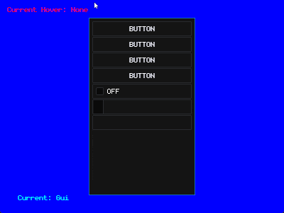

# FlatStage Game Engine

FlatStage is a Game Engine made in C# and latest .NET. Right now it has the following features:

 - Platform Abstraction with SDL2: Windowing and Input;
 - Useful custom common abstractions such as Math functions, Color, Rect, Matrix, Random;
 - Input methods supported: Keyboard, Mouse and Gamepad;
 - Optimized batched 2D shader based rendering using BGFX;
 - Font support by building bitmap fonts from TTF files using Freetype;
 - Powerful content management system;
 - Audio Playing with MiniAudio library;
 - Custom made Gui system;
 - Always growing Toolkit classes with useful classes;
 - Demo Games. Currently implemented: A full Tetris clone game;
 - More to come...

Focus on keeping a clean, easy to use and understand core while adding useful common features for games on top;
Current implemented features are always being improved. New features added only if essential or really useful;

## Build

    dotnet build
    dotnet run

## Images:

**::::::: Tetris Clone Demo :::::::**

**::::::: Gui 001 :::::::::::::::::**

